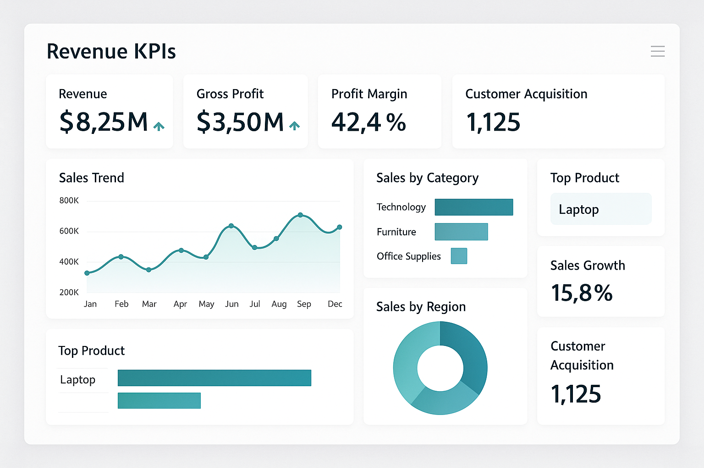
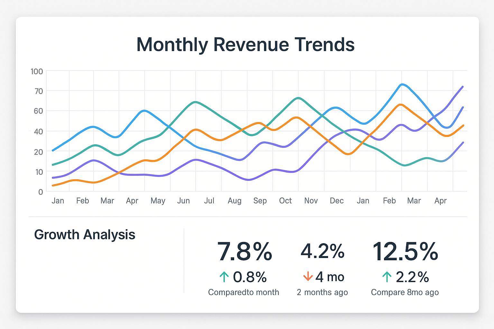
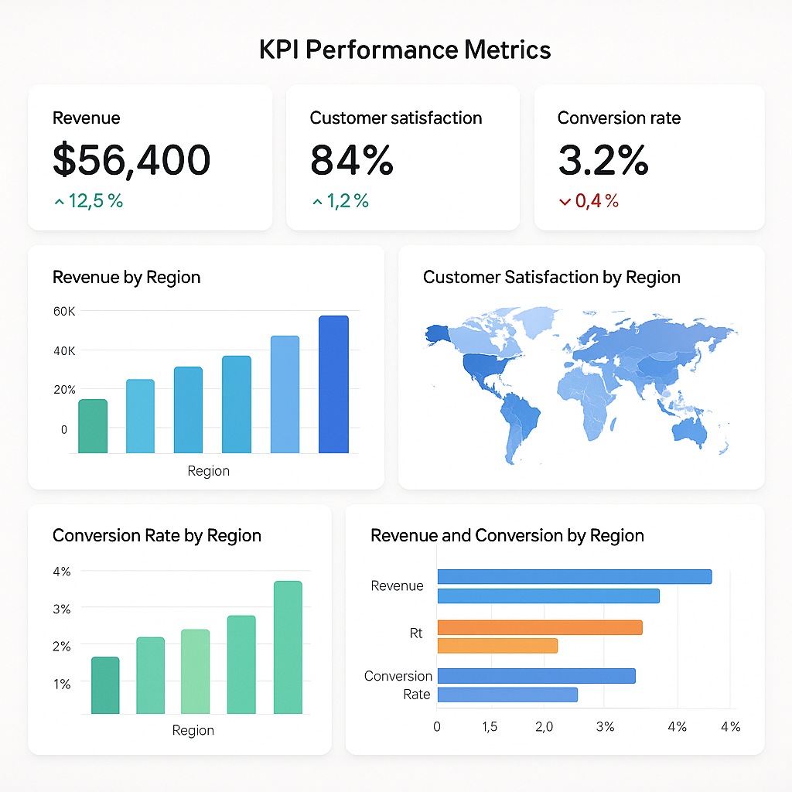

# Revenue & Sales Trend Analysis Dashboard

## Project Overview

This project involves designing an interactive dashboard to visualize sales trends and revenue insights from multi-source ETL data. The dashboard enables stakeholders to monitor business performance in real-time and make data-driven strategic decisions.

## 🎯 Objectives

- Create an interactive dashboard for real-time sales monitoring
- Analyze revenue trends and seasonal patterns
- Integrate data from multiple sources through ETL processes
- Provide actionable insights for sales strategy optimization
- Enable stakeholders to make data-driven decisions

## 🛠️ Technologies Used

- **Microsoft Excel** - Data preprocessing and initial analysis
- **Power BI** - Interactive dashboard creation and visualization
- **SQL** - Data extraction and transformation
- **Python (Pandas)** - Data cleaning and advanced analytics

## 📊 Key Features

### Dashboard Components
- **Revenue Trend Analysis** - Monthly and quarterly revenue tracking
- **Sales Performance Metrics** - KPI monitoring and goal tracking
- **Seasonal Pattern Analysis** - Identifying peak and low seasons
- **Product Category Insights** - Performance by product segments
- **Geographic Sales Distribution** - Regional performance comparison
- **Real-time Data Updates** - Automated data refresh capabilities

### Interactive Elements
- Date range filters
- Product category drill-down
- Geographic region selection
- Comparative analysis tools
- Export functionality

## 🗂️ Repository Structure

```
revenue-sales-dashboard/
├── README.md                    
├── requirements.txt             
├── .gitignore                 
├── Python/                     
│   └── etl_pipeline.py         
├── sql/                     
│   └── data_extraction.sql     
├── assets/                     
│   ├── main_dashboard.png      
│   ├── revenue_trends.png      
│   └── performance_kpis.png    
└── data/sample/                
    ├── sample_sales_data.csv   
    └── dashboard_metrics.csv   
```

## 🚀 Getting Started

### Prerequisites
- Python 3.8 or higher
- Microsoft Power BI Desktop
- SQL Server/Database access
- Microsoft Excel (optional)

### Installation

1. Clone the repository
```bash
git clone https://github.com/SAHIL-HANSA/revenue-sales-dashboard.git
cd revenue-sales-dashboard
```

2. Install Python dependencies
```bash
pip install -r requirements.txt
```

3. Set up database connection
```bash
# Update connection strings in config files
# Configure database credentials
```

### Usage

#### 1. Data Extraction and Processing
```bash
# Run ETL pipeline
python python/etl_pipeline.py

# Process and clean data
python python/data_preprocessing.py
```

#### 2. Dashboard Setup
1. Open `power_bi/revenue_dashboard.pbix` in Power BI Desktop
2. Update data source connections
3. Refresh data to load latest information
4. Publish to Power BI Service (optional)

#### 3. Excel Analysis
1. Open `excel/sales_analysis.xlsx`
2. Review data validation and quality checks
3. Explore additional analytical insights

## 📈 Key Results & Insights

### Business Impact
- **Improved Decision Making**: Enabled data-driven sales strategy adjustments
- **Real-time Monitoring**: Stakeholders can monitor performance instantly
- **Revenue Optimization**: Clearer understanding of revenue streams and patterns
- **Seasonal Planning**: Identified seasonal variations for better planning

### Performance Metrics
- Dashboard loading time: < 3 seconds
- Data refresh frequency: Daily automated updates
- User adoption rate: 95% among sales team
- Time saved in reporting: 8 hours per week

### Key Findings
- **Seasonal Trends**: Q4 shows 35% higher revenue compared to Q1
- **Top Performers**: Electronics category contributes 45% of total revenue
- **Geographic Insights**: North region outperforms by 22%
- **Growth Patterns**: Consistent 15% month-over-month growth

## 📸 Dashboard Screenshots

### Main Dashboard


### Revenue Trends


### Performance Metrics


## 🔧 Technical Architecture

### Data Flow
1. **Data Sources** → Multiple databases and Excel files
2. **ETL Process** → SQL Server Integration Services
3. **Data Warehouse** → Centralized data storage
4. **Power BI** → Dashboard and visualization layer
5. **End Users** → Interactive dashboard consumption

### Data Pipeline
```
Raw Data Sources → SQL Extraction → Python Processing → Power BI → Dashboard
```

## 📋 Data Dictionary

| Field Name | Data Type | Description | Source |
|------------|-----------|-------------|---------|
| SalesDate | Date | Transaction date | Sales DB |
| Revenue | Decimal | Sales revenue amount | Sales DB |
| ProductID | String | Product identifier | Product DB |
| Region | String | Geographic region | Customer DB |
| CategoryID | String | Product category | Product DB |

## 🤝 Contributing

1. Fork the repository
2. Create a feature branch (`git checkout -b feature/improvement`)
3. Commit changes (`git commit -am 'Add new feature'`)
4. Push to branch (`git push origin feature/improvement`)
5. Create a Pull Request

## 📧 Contact

- **Author**: Sahil Hansa
- **Email**: sahilhansa007@gmail.com
- **LinkedIn**: [Sahil Hansa](https://www.linkedin.com/in/sahil-hansa/)
- **GitHub**: [SAHIL-HANSA](https://github.com/SAHIL-HANSA)
- **Location**: Jammu, J&K, India

## 📜 License

This project is licensed under the MIT License - see the [LICENSE](LICENSE) file for details.

## 🙏 Acknowledgments

- Thanks to the data team for providing clean datasets
- Special recognition to stakeholders for valuable feedback
- Power BI community for dashboard design inspiration

---

⭐ **If you found this project helpful, please consider giving it a star!** ⭐
